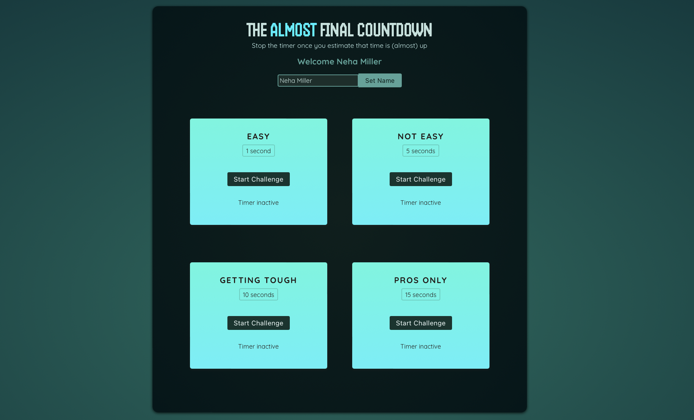
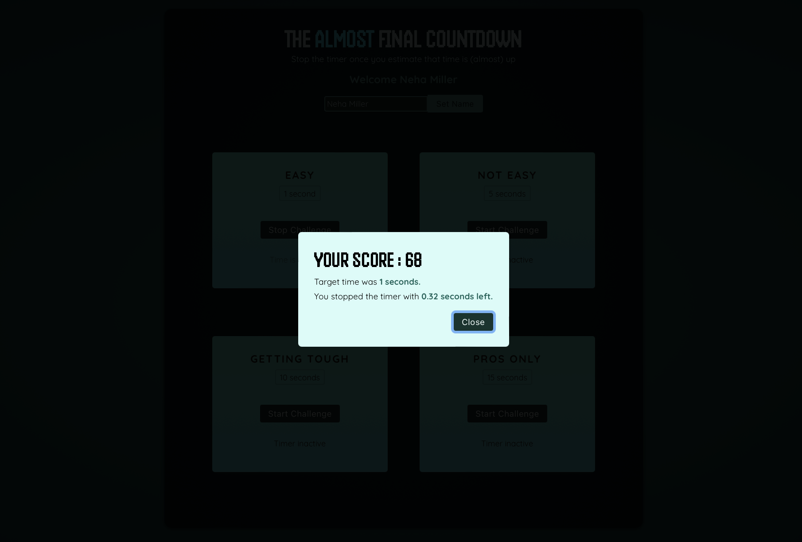

# Timer Challenge

This is a Timer Challenge Game using ReactJS. Player has to start the timer by clicking the Start Challenge button and then stop the timer once they estimate that the time is almost up. The less the time remaining is the high the score will be. If the user doesn't stop the timer before the time is up they lose.

